# 🚀 DikaRoute

<p align="center">
  
</p>

<p align="center">
  <b>Unified AI Gateway &amp; Intelligent Model Router</b><br />
  Connect multiple AI providers through one OpenAI-compatible API.
</p>

<p align="center">
  <a href="https://www.npmjs.com/package/dikaroute"></a>
  <a href="https://www.npmjs.com/package/dikaroute"></a>
  <a href="https://github.com/dikaofc/DikaRoute/blob/main/LICENSE"></a>
  <a href="https://github.com/dikaofc/DikaRoute"></a>
  <a href="https://github.com/dikaofc/DikaRoute/commits/main"></a>
  <a href="https://github.com/dikaofc/DikaRoute/actions/workflows/publish.yml"></a>
</p>

<p align="center">
  <a href="#-quickstart"></a>
  <a href="#-api-reference"></a>
  <a href="#-configuration"></a>
  <a href="https://github.com/dikaofc/DikaRoute/releases"></a>
</p>

---

## 📑 Table of Contents

- [🌐 Overview](#-overview)
- [✨ Features](#-features)
- [🏗️ Architecture](#-architecture)
- [🚀 Quickstart](#-quickstart)
- [⚙️ Configuration](#-configuration)
- [🔌 API Reference](#-api-reference)
- [📊 Dashboard](#-dashboard)
- [🛡️ Reliability & Fallback](#-reliability--fallback)
- [🧠 Compression & Context Optimization](#-compression--context-optimization)
- [🔐 Security](#-security)
- [🐳 Docker Deployment](#-docker-deployment)
- [🤖 CLI & Ecosystem](#-cli--ecosystem)
- [📦 Releases & Changelog](#-releases--changelog)
- [❓ FAQ](#-faq)
- [🛠️ Troubleshooting](#-troubleshooting)
- [🤝 Contributing](#-contributing)
- [📄 License](#-license)

---

## 🌐 Overview

**DikaRoute** is a lightweight, high-performance AI routing gateway that unifies multiple Large Language Model providers into a **single, OpenAI-compatible API**. Instead of managing multiple endpoints, API keys, SDK differences, rate limits, and provider failures separately, DikaRoute provides one centralized gateway that handles:

|                              |                              |                               |
| ---------------------------- | ---------------------------- | ----------------------------- |
| 🔀 Multi-provider AI routing | 🛡️ Automatic fallback system | 🧠 Model selection strategy   |
| ✂️ Context optimization      | 🗜️ Response compression      | 💓 Provider health monitoring |
| 📊 Usage analytics           | 🔑 API key isolation         | 📡 Webhooks & live monitoring |

> **The goal is simple: one endpoint. Multiple AI providers. Maximum reliability.**

---

## ✨ Features

| Feature                       | Description                                                                                                                          |
| ----------------------------- | ------------------------------------------------------------------------------------------------------------------------------------ |
| 🔀 **Intelligent Routing**    | Priority routing, round-robin, health-based, model-based, and fully custom routing rules.                                            |
| 🛡️ **Automatic Fallback**     | Rate limits, outages, and dead API credits? Requests automatically fail over to the next healthy provider — no app changes required. |
| 🧠 **Context Compression**    | RTK & CCR compression engines, payload rules, and prefix freezing slash token spend on long sessions.                                |
| ⚡ **Performance Focused**    | Minimal proxy overhead, efficient forwarding, connection reuse, and lightweight architecture.                                        |
| 🔌 **OpenAI Compatible**      | Drop-in for anything that speaks the OpenAI API — Claude Code, Cursor, custom apps, agents.                                          |
| 📊 **Dashboard & Monitoring** | Provider status, request stats, token usage, latency, error tracking, and configuration management.                                  |
| 🔐 **Security First**         | Encrypted secrets at rest, SSRF guard, prompt-injection guard, PII sanitizer, credential masking, rate limits & budgets.             |
| 🐳 **Docker Native**          | Official images, `docker-compose` for dev, `docker-compose.prod.yml` for production split ports.                                     |
| 🤖 **CLI Ecosystem**          | One-command setup for Claude Code, Codex, Cursor, Cline, Continue, Roo, Goose, Qwen, Aider, OpenCode + a full admin CLI.             |
| 🔁 **OAuth & Multi-Account**  | Claude Code, Codex, Gemini, Antigravity, Kimi, GitHub Copilot, GitLab Duo, Qoder, Trae and more.                                     |
| 📡 **Tunnels & Sync**         | Built-in ngrok / Cloudflare / Tailscale tunnels and optional cloud config sync.                                                      |

---

## 🏗️ Architecture

```
                 User Applications

        Claude Code        Cursor
        Custom Apps        AI Agents
                 |
                 |
          OpenAI Compatible API
                 |
                 |
             DikaRoute
        ┌──────────┼──────────┐
        |          |          |
     Router     Cache     Monitor
        |          |          |
        └──────────┼──────────┘
                   |
            AI Providers
     ┌─────────┬─────┬─────────┐
  OpenAI   Anthropic   Gemini   Ollama · Custom APIs
```

**How a request flows:**

1. A client sends an OpenAI-style request to `POST /v1/chat/completions`.
2. The **router** selects a provider based on your strategy (priority, round-robin, health score, model map…).
3. The pipeline applies context **compression**, **payload rules**, and **rate-limit/budget** checks.
4. If the primary provider fails (429 / 5xx / timeout / outage), the **fallback engine** transparently retries on the next candidate.
5. Responses are **streamed** (SSE) back to the client while **usage analytics** and **spend tracking** are recorded.

---

## 🚀 Quickstart

### 📦 NPM (recommended)

```bash
# Install globally
npm install -g dikaroute

# Start the dashboard (default: http://localhost:20128)
dikaroute

# Update to the latest version
dikaroute update
```

### 🧱 From Source

```bash
git clone https://github.com/dikaofc/DikaRoute.git
cd DikaRoute
npm install
npm run start
```

### 🐳 Docker

```bash
# Development stack (dashboard + API on :20128)
docker compose up -d

# Production stack (split ports)
docker compose -f docker-compose.prod.yml up -d
```

### 🚦 First Run

1. Open the dashboard at `http://localhost:20128`.
2. Log in with the initial password (`INITIAL_PASSWORD` env var, default `CHANGEME` — change it in _Dashboard → Settings → Security_).
3. Add providers in _Dashboard → Providers_ (OpenAI, Anthropic, Gemini, Ollama, custom OpenAI-compatible endpoints, OAuth providers…).
4. Start chatting — or point any OpenAI-compatible client at `http://localhost:20128/v1`.

---

## ⚙️ Configuration

### Providers

Providers are configured from the dashboard (or `dikaroute providers`), with per-provider API keys, base URLs, models, concurrency and rate-limit windows.

```json
{
  "providers": {
    "openai": { "enabled": true, "apiKey": "sk-..." },
    "anthropic": { "enabled": true, "apiKey": "sk-ant-..." },
    "ollama": { "enabled": true, "baseUrl": "http://localhost:11434" }
  },
  "routing": { "strategy": "auto-fallback" }
}
```

### Routing Strategies

| Strategy          | Behavior                                            |
| ----------------- | --------------------------------------------------- |
| **Priority**      | Always try providers in configured order.           |
| **Round-robin**   | Distribute load evenly across eligible providers.   |
| **Auto-fallback** | Try the primary; cascade to backups on failure.     |
| **Health-based**  | Prefer providers with the best recent health score. |
| **Model-based**   | Route by model ID prefix / custom rules.            |
| **Custom rules**  | Fully custom routing via the rules engine.          |

### Environment Variables

Copy `.env.example` → `.env` and adjust. The full contract is documented in [docs/reference/ENVIRONMENT.md](docs/reference/ENVIRONMENT.md). Essentials:

| Variable                                   | Purpose                                                      | Default                  |
| ------------------------------------------ | ------------------------------------------------------------ | ------------------------ |
| `JWT_SECRET`                               | Signs dashboard session tokens. **Required.**                | —                        |
| `API_KEY_SECRET`                           | Encrypts provider API keys at rest in SQLite. **Required.**  | —                        |
| `INITIAL_PASSWORD`                         | First-boot admin password.                                   | `CHANGEME`               |
| `STORAGE_ENCRYPTION_KEY`                   | Optional full SQLite encryption at rest.                     | empty (off)              |
| `DATA_DIR`                                 | Persistent data directory (DB, logs, backups).               | `~/.dikaroute/`          |
| `PORT`                                     | Dashboard + API port (single-port mode).                     | `20128`                  |
| `API_PORT` / `DASHBOARD_PORT`              | Split-port mode for network isolation.                       | `20129` / `20128`        |
| `LIVE_WS_PORT`                             | Real-time dashboard WebSocket.                               | `20132`                  |
| `BASE_URL` / `NEXT_PUBLIC_BASE_URL`        | Public-facing base URL (reverse proxy / OAuth).              | `http://localhost:20128` |
| `REQUIRE_API_KEY`                          | Require an API key for all `/v1/*` endpoints.                | `false`                  |
| `AUTH_COOKIE_SECURE`                       | Must be `true` behind HTTPS.                                 | `false`                  |
| `REDIS_URL`                                | Optional Redis for rate limiting (else in-memory).           | —                        |
| `DIKAROUTE_ALLOW_PRIVATE_PROVIDER_URLS`    | Allow local/private provider URLs (Ollama, LM Studio, vLLM). | `false`                  |
| `CORS_ALLOWED_ORIGINS`                     | Extra cross-origin clients for the API.                      | —                        |
| `HTTP_PROXY` / `HTTPS_PROXY` / `ALL_PROXY` | Route upstream calls through an egress proxy.                | —                        |
| `ENABLE_TLS_FINGERPRINT`                   | Spoof Chrome TLS fingerprint to avoid provider blocking.     | `false`                  |
| `INPUT_SANITIZER_MODE`                     | Prompt-injection guard mode (`warn` / `block`).              | `warn`                   |
| `PII_RESPONSE_SANITIZATION`                | Redact PII from LLM responses.                               | `false`                  |

---

## 🔌 API Reference

DikaRoute exposes an **OpenAI-compatible** API at `http://localhost:20128/v1`. Any application that supports the OpenAI format can connect without major changes.

| Method | Path                         | Description                                           |
| ------ | ---------------------------- | ----------------------------------------------------- |
| `POST` | `/v1/chat/completions`       | Chat completions — streaming (SSE) and non-streaming. |
| `GET`  | `/v1/models`                 | List models available through the gateway.            |
| `POST` | `/v1/responses`              | Codex-style Responses API.                            |
| `POST` | `/v1/relay/chat/completions` | Relay endpoint with per-IP rate limiting.             |
| `WS`   | `/v1/ws`                     | Real-time live monitoring WebSocket.                  |
| `*`    | `/api/mcp`                   | MCP server tools (scope-based access control).        |
| `*`    | `/v1/vscode/[token]/*`       | VS Code tokenized routes with context sanitization.   |
| `GET`  | `/api/openapi.yaml`          | Interactive OpenAPI spec.                             |

### Chat Completion

```bash
curl http://localhost:20128/v1/chat/completions \
  -H "Authorization: Bearer YOUR_KEY" \
  -H "Content-Type: application/json" \
  -d '{
    "model": "auto",
    "messages": [
      { "role": "user", "content": "Hello AI" }
    ]
  }'
```

### Streaming (SSE)

```bash
curl -N http://localhost:20128/v1/chat/completions \
  -H "Authorization: Bearer YOUR_KEY" \
  -H "Content-Type: application/json" \
  -d '{
    "model": "auto",
    "stream": true,
    "messages": [{ "role": "user", "content": "Tell me a story" }]
  }'
```

> `"model": "auto"` lets DikaRoute pick the best provider/model for you.

---

## 📊 Dashboard

The web dashboard gives you full control and visibility over your AI infrastructure:

- 🟢 Provider status & health scores
- 📈 Request statistics & latency monitoring
- 🪙 Token usage, cost tracking & budgets
- ❌ Error tracking & retry insights
- 🧩 Providers, models, keys & routing management
- 🕸️ Combo/round-robin configuration
- 🧠 Context & compression settings
- 🔔 Webhooks, notifications & real-time live view (WebSocket)

---

## 🛡️ Reliability & Fallback

```
Request
   |
   v
Primary Provider
   |
   Failed? ──no──▶ Response
   |
   v
Backup Provider
   |
   v
Response
```

DikaRoute layers multiple reliability mechanisms:

- **Auto-fallback** across providers on 429 / 5xx / network errors / timeouts.
- **Provider health checks** with configurable intervals and cooldown recovery.
- **Connection recovery** — proactively re-validates cooled-down connections outside the hot path.
- **Warmup scheduler** for OAuth accounts to avoid cold-window throttling.
- **Emergency fallback** reroutes budget-exhausted requests.
- **Rate limiting** per API key (daily/weekly/monthly windows) and per IP.
- **Budgets** with automatic enforcement and reset jobs.
- **Admission control** prevents OOM on heavy concurrent payloads (503 + `Retry-After`).

---

## 🧠 Compression & Context Optimization

Long AI conversations consume tokens quickly. DikaRoute reduces payload size while preserving useful information:

- **RTK & CCR compression engines** with hot-reloadable payload rules.
- **Context optimization** — smarter system-prompt & history handling.
- **Prefix freezing** preserves stable, cacheable prefixes from compression.
- **Token & cost tracking** so you always know what each conversation costs.

**Benefits:** lower token usage · faster responses · reduced API costs · better long-session performance.

---

## 🔐 Security

| Layer                         | What it does                                                                                                          |
| ----------------------------- | --------------------------------------------------------------------------------------------------------------------- |
| 🔑 **Secret isolation**       | Provider keys encrypted at rest in SQLite (`API_KEY_SECRET`); optional full-DB encryption (`STORAGE_ENCRYPTION_KEY`). |
| 🧱 **SSRF guard**             | Blocks outbound calls to private/cloud-metadata networks unless explicitly allowed.                                   |
| 🛡️ **Prompt-injection guard** | Scans incoming messages for injection patterns (`warn` / `block` / threshold modes).                                  |
| 👁️ **PII sanitizer**          | Redacts or blocks PII in requests and LLM responses.                                                                  |
| 🎭 **Credential masking**     | Hides well-known API-key patterns in payloads and logs.                                                               |
| 🚦 **Rate limits & budgets**  | Per-key and per-IP gates, spend tracking, quota monitoring.                                                           |
| 🧭 **Proxy egress**           | HTTP/SOCKS5 egress with fail-closed mode + optional TLS fingerprint spoofing.                                         |
| 🔒 **Access control**         | `REQUIRE_API_KEY`, scoped MCP access, JWT sessions, secure cookies, CORS allow-lists.                                 |

---

## 🐳 Docker Deployment

```bash
# Development
docker compose up -d

# Production (split dashboard/API ports)
docker compose -f docker-compose.prod.yml up -d
```

- **Data persistence:** mount a host directory to `DATA_DIR` (e.g. `./data` or `/var/lib/dikaroute`).
- **Production ports:** host publishes `PROD_DASHBOARD_PORT` (default `20130`) and `PROD_API_PORT` (default `20131`).
- **Podman:** set `CONTAINER_HOST=podman`.
- **Behind a proxy:** set `DIKAROUTE_BASE_PATH` for subpath serving and `NEXT_PUBLIC_BASE_URL` for the public origin.

---

## 🤖 CLI & Ecosystem

Run `dikaroute` for the dashboard, or use the CLI for everything else:

| Command                                                                                                                    | Purpose                               |
| -------------------------------------------------------------------------------------------------------------------------- | ------------------------------------- |
| `dikaroute setup-claude`                                                                                                   | One-command Claude Code integration   |
| `dikaroute setup-codex`                                                                                                    | One-command Codex integration         |
| `dikaroute setup-cursor`                                                                                                   | One-command Cursor integration        |
| `dikaroute setup-cline` / `setup-continue` / `setup-roo` / `setup-goose` / `setup-qwen` / `setup-aider` / `setup-opencode` | One-command setups for other agents   |
| `dikaroute dashboard`                                                                                                      | Open the web dashboard                |
| `dikaroute status` / `health`                                                                                              | Gateway & provider health             |
| `dikaroute providers` / `models`                                                                                           | Manage providers & models             |
| `dikaroute keys` / `usage` / `cost` / `tokens`                                                                             | Keys, usage, spend, token tracking    |
| `dikaroute logs` / `doctor`                                                                                                | Logs & diagnostics                    |
| `dikaroute tunnel`                                                                                                         | ngrok / Cloudflare / Tailscale tunnel |
| `dikaroute mcp`                                                                                                            | MCP server tooling                    |
| `dikaroute webhooks`                                                                                                       | Webhook management                    |
| `dikaroute backup` / `restart` / `stop` / `serve`                                                                          | Ops commands                          |
| `dikaroute update`                                                                                                         | Self-update                           |

---

## 📦 Releases & Changelog

|                        |                                                                                                                |
| ---------------------- | -------------------------------------------------------------------------------------------------------------- |
| **Current version**    | [](https://www.npmjs.com/package/dikaroute) |
| 📝 **Changelog**       | [CHANGELOG.md](./CHANGELOG.md) — detailed release notes, also rendered inside the dashboard                    |
| 🏷️ **GitHub Releases** | [Releases](https://github.com/dikaofc/DikaRoute/releases)                                                      |
| 📦 **npm**             | [dikaroute](https://www.npmjs.com/package/dikaroute)                                                           |

---

## ❓ FAQ

<details>
<summary><b>What exactly is DikaRoute?</b></summary>

A self-hosted AI gateway: it sits between your apps and multiple LLM providers, giving you one OpenAI-compatible endpoint with routing, fallback, compression, monitoring, and security.
</details>

<details>
<summary><b>Which providers are supported?</b></summary>

Any OpenAI-compatible API (OpenAI, Anthropic, Google Gemini, Ollama, LM Studio, vLLM, custom endpoints…) plus OAuth-based providers such as Claude Code, Codex, Gemini, Antigravity, Kimi, GitHub Copilot, GitLab Duo, Qoder and Trae.
</details>

<details>
<summary><b>Does DikaRoute store my API keys?</b></summary>

Yes, in local SQLite, encrypted at rest with `API_KEY_SECRET`. Enable `STORAGE_ENCRYPTION_KEY` for full database encryption.
</details>

<details>
<summary><b>Can I use local models?</b></summary>

Yes — point DikaRoute at Ollama, LM Studio, vLLM, or Llamafile and set `DIKAROUTE_ALLOW_PRIVATE_PROVIDER_URLS=true`.
</details>

<details>
<summary><b>What port does it use?</b></summary>

Dashboard + API: `20128` (default). Split mode: API `20129`, Dashboard `20128`. Live WebSocket: `20132`. All configurable via env vars.
</details>

<details>
<summary><b>Can I expose it to the internet?</b></summary>

Yes. Set `NEXT_PUBLIC_BASE_URL`, use `AUTH_COOKIE_SECURE=true` behind HTTPS, require an API key if public, and use the built-in tunnel commands (ngrok / Cloudflare / Tailscale) or your own reverse proxy.
</details>

<details>
<summary><b>How does automatic fallback work?</b></summary>

When the primary provider fails (rate limit, outage, timeout, 5xx), the request automatically retries on the next healthy provider in your configured order — transparently, with no application changes.
</details>

---

## 🛠️ Troubleshooting

| Problem                                  | Fix                                                                                     |
| ---------------------------------------- | --------------------------------------------------------------------------------------- |
| Can't log in on first boot               | Use `INITIAL_PASSWORD` (default `CHANGEME`), then change it in _Settings → Security_.   |
| Port 20128 already in use                | Set a different `PORT` in `.env`, or check `dikaroute status`.                          |
| Local provider unreachable (Ollama etc.) | Set `DIKAROUTE_ALLOW_PRIVATE_PROVIDER_URLS=true`.                                       |
| Provider keys show "invalid"             | Re-add the key; check `dikaroute doctor` and `dikaroute logs`.                          |
| Streaming feels slow                     | Check `LIVE_WS_PORT`/proxy buffering; disable response buffering in your reverse proxy. |
| OAuth login redirects to localhost       | Set `NEXT_PUBLIC_BASE_URL=https://your-domain.com` and register your own OAuth app.     |

---

## 🤝 Contributing

Contributions are welcome! Feel free to:

1. 🍴 Fork the repository
2. 🌿 Create a feature branch
3. ✏️ Make your changes
4. ✅ Open a Pull Request

Found a bug or have an idea? [Open an issue](https://github.com/dikaofc/DikaRoute/issues).

---

## 📄 License

**MIT License** — Copyright © DikaCode

Built with ❤️ for developers building the next generation of AI applications.

<p align="center">
  <a href="https://github.com/dikaofc"></a>
  <a href="https://t.me/dikaacode"></a>
  <a href="https://obitoglory.tech"></a>
</p>
